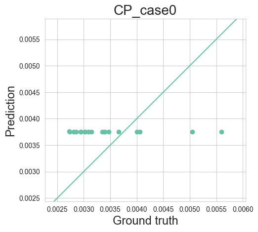

# NGV_project
## 230811
- Data-driven Optimization (given dataset from LDW)
- Problems: outliers in the first QoI, named "CP_case0"
- Outliers make the training of GPR impossible (see the results below)

- Therefore, outliers in the training dataset are removed manually as follows
  ```python 
  self.x_train = np.delete(self.x_train,[14,50],axis=0)
  self.y_train = np.delete(self.y_train,[14,50],axis=0)
  ```
